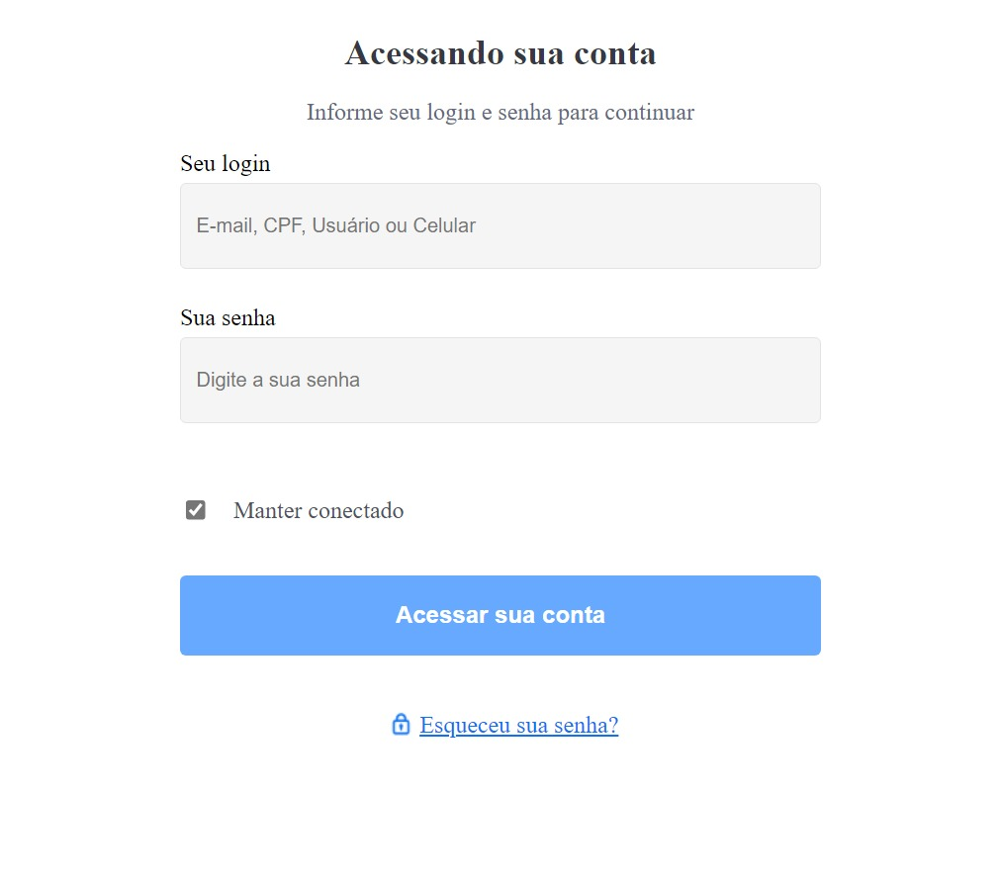

<h3 align="center">
    <br><br>
    <b>Validando uma POC - (PROOF OF CONCEPT) - Atraves da criação de uma biblioteca Npm com Web Component utlizando a Lib - lit-element para criar componentes reutilizaveis em qualquer frameworks ( Angular, React, Vue)  </b>  
    <br>
</h3>
<br>

# Índice

- [Sobre](#sobre)
- [Tecnologias Utilizadas](#tecnologias-utilizadas)
- [Conceitos Aprendido](#conceito-aprendido)
- [Como Usar](#como-usar)
- [Como Contribuir](#como-contribuir)

## :bookmark: Sobre

<strong>Criando uma biblioteca Npm com Web Component - utlizando a Lib - lit-element e tailwindCss</strong>

## Proposta

O projeto consiste em criar uma pagina de login

## :heavy_check_mark: :iphone: Aplicação Front end

<h1 align="center">
    
</h1>

<a id="tecnologias-utilizadas"></a>

## :rocket: Tecnologias Utilizadas

O projeto foi desenvolvido utilizando as seguintes tecnologias

- [ ] Typescript
- [ ] TailwindCss
- [ ] Rollup
- [ ] Npm-run-all
- [ ] lit-element
- [ ] GitHub Package Registry

<p> Utilize npm install para instalar as dependências do projeto. Em seguida, inicie o projeto.</p>

```
- Fron end
  * instalar dependências
  npm install

  * rodar projeto
  npm start

```

<a id="como-contribuir"></a>

# :recycle: Como contribuir

- Faça um Fork desse repositório,
- Crie uma branch com a sua feature: `git checkout -b my-feature`
- Commit suas mudanças: `git commit -m 'feat: My new feature'`
- Push a sua branch: `git push origin my-feature`

<a id="como-usar"></a>

## :fire: Como usar

1. Faça o clone da aplicação web utilizada para consumir a biblioteca Npm :

```sh
   $ git clone https://github.com/Rafael-Rufino/web
```

2. Faça o clone do repositorio da biblioteca NPM :

```sh
  $ git clone https://github.com/Rafael-Rufino/web-components-with-litelement-publish-in-npm
```
## Versão da lib atualizada

```
$ npm install @rafael-rufino/web-components-with-litelement-publish-in-npm@0.1.5

```

## :memo: License

Esse projeto está sob a licença MIT. Veja o arquivo [LICENSE](LICENSE.md) para mais detalhes.

<h4 align="center">
    Feito com 💜 by <a href="https://portfolio-rafael-rufino.vercel.app/" target="_blank">Rafael Rufino</a>
</h4>
